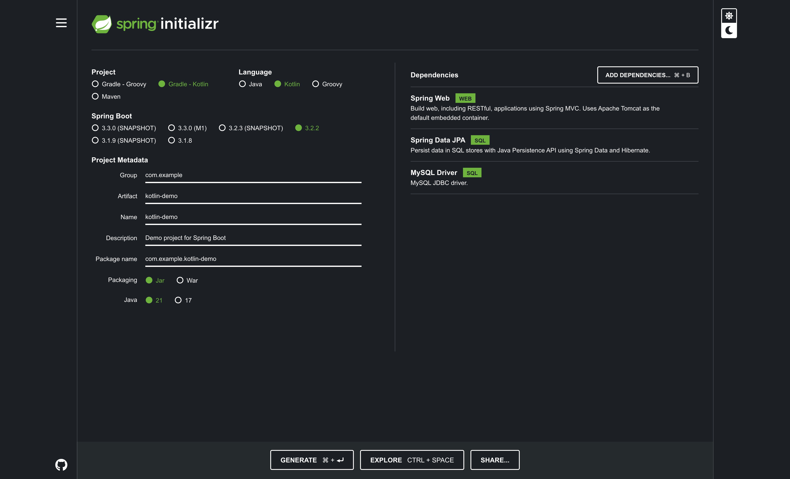
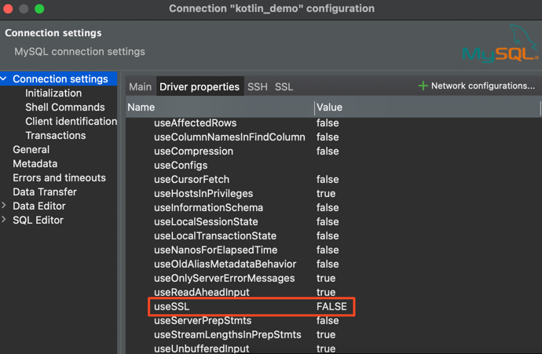

# Test Spring Boot 3 with Kotlin

## Project Configuration

I create the Spring Boot project using IntelliJ IDEA.


You can use the [Spring Initializr](https://start.spring.io/) with the same configuration.



## Project Structures


## Code Configuration

### Dependencies

Please add this validation dependency to your `build.gradle.kts` file.

```kotlin
implementation("org.springframework.boot:spring-boot-starter-validation")
```

### Application Properties

Please change this configuration to your `application.properties` file.

```properties
# Spring DATASOURCE (DataSourceAutoConfiguration & DataSourceProperties)
spring.datasource.url = jdbc:mysql://localhost:3306/kotlin_demo?allowPublicKeyRetrieval=true&autoReconnect=true&useUnicode=true&characterEncoding=UTF-8&allowMultiQueries=true&useSSL=false
spring.datasource.username = <- Change to your username
spring.datasource.password = <- Change to your password
spring.datasource.driver-class-name=com.mysql.cj.jdbc.Driver

# Hibernate Properties

# The SQL dialect makes Hibernate generate better SQL for the chosen database
spring.jpa.database-platform=org.hibernate.dialect.MySQL8Dialect

# Hibernate show SQL
spring.jpa.show-sql=true

# Hibernate naming strategy
spring.jpa.generate-ddl=true

# Hibernate ddl auto (create, create-drop, validate, update)
spring.jpa.hibernate.ddl-auto = update
```

### Docker Configuration

Please change this configuration to your `docker-compose.yml` file.

```yaml
version: '3.1'

services:
  mysql_db:
    image: mysql:8.3
    container_name: mysql_db
    restart: always
    environment:
      - MYSQL_ROOT_PASSWORD= <- Change to your password
      - MYSQL_DATABASE=kotlin_demo
      - MYSQL_USER= <- Change to your username
      - MYSQL_PASSWORD= <- Change to your password
    ports:
      - "3306:3306"
```

## Run the Project

### Run the Docker

Please run the docker-compose file using this command.

```shell
docker-compose up -d
```

### Check if the database is running using [DBeaver](https://dbeaver.io/)

Create a new connection using the following configuration:


Also set two properties in the `Driver properties` tab:




Click `Test Connection` to check if the connection is successful.


### Run the Spring Boot Project

You can run the project by using IntelliJ IDEA or using the following command:

```shell
./gradlew bootRun
```

### Test the API

You can test the API by using the collection in the `postman` folder.